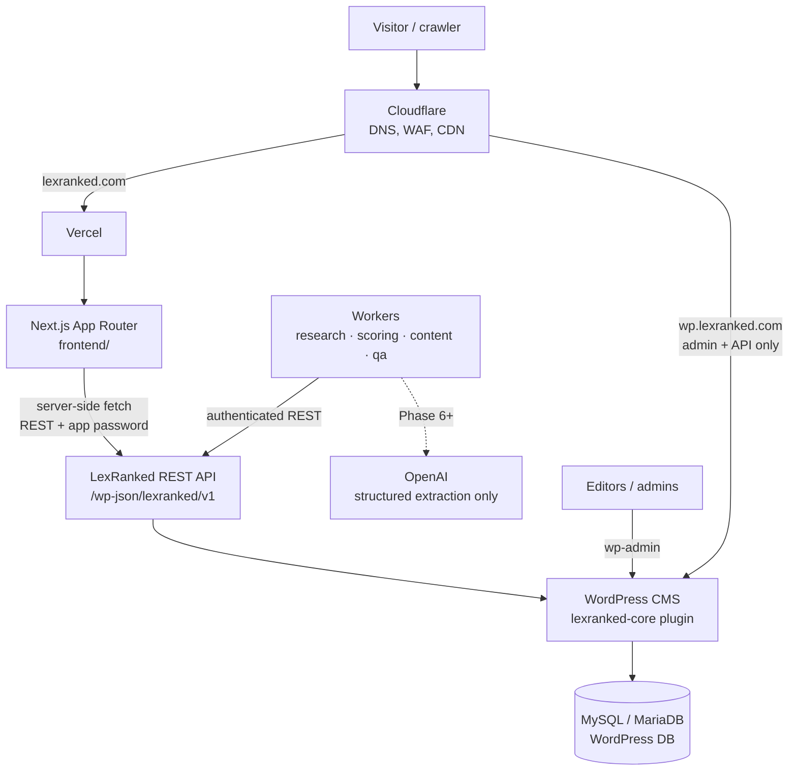

# Architecture

LexRanked is a **headless** platform. WordPress is the CMS and administrative
backend; a Next.js application is the only public frontend.

## System diagram



ASCII fallback:

```
Cloudflare ──▶ Vercel ──▶ Next.js frontend ──▶ LexRanked REST API ──▶ WordPress + lexranked-core ──▶ Database
                                                        ▲
                                         Workers ───────┘  (research, scoring, content, QA)
```

## Responsibilities

| Layer | Owns | Must not |
|-------|------|----------|
| Next.js (`frontend/`) | Rendering, routing, SEO metadata, JSON-LD, sitemap, caching/revalidation | Contain ranking or verification logic; hold secrets in client bundles |
| REST API (`lexranked/v1`) | Stable DTOs, validation, pagination, permissions | Return raw `WP_Post` objects or private fields |
| `lexranked-core` plugin | Entities, evidence, verification, ranking engine, admin UI, audit logs | Depend on a theme |
| WordPress | Storage, users/capabilities, editorial workflow | Serve the public site |
| Workers (`workers/`) | Long-running research, recalculation, drafting, QA | Write directly to the database, publish content (only the plugin publishes, by fixed rules), or decide rankings with an LLM |

## Repository layout

```
frontend/                      Next.js (App Router, TypeScript)
wordpress/plugins/lexranked-core/  All LexRanked business logic (PHP)
workers/                       Background jobs (Phase 4+)
database/                      Reference schema + migrations
scripts/                       Developer tooling (scripts/check.sh = CI locally)
docs/                          Documentation (this folder)
.github/workflows/             CI
```

## Architectural decisions

Each decision is recorded here with its rationale. Add new entries rather than
editing old ones; mark superseded entries.

### ADR-001 — Headless WordPress + Next.js
WordPress gives editors a mature admin, users/capabilities, revisions and
drafts. Next.js gives SEO control, server rendering and edge caching on
Vercel. The public site never uses a WordPress theme; `wp.lexranked.com` is
admin/API only and should be `noindex` and firewalled at Cloudflare.

### ADR-002 — Business logic lives in the `lexranked-core` plugin
One plugin, namespaced `LexRanked\Core`, PSR-4 under `src/`. The plugin
ships its own tiny autoloader so production needs no `vendor/`; Composer is
used only for development tooling (PHPUnit, PHPCS).

### ADR-003 — Stable DTOs are the contract
The frontend consumes versioned DTOs (`docs/api.md`), not WordPress objects.
This is the seam that allows moving ranking/research data to PostgreSQL later
without a frontend rewrite.

### ADR-004 — WordPress database first, PostgreSQL later (maybe)
Custom post types + meta for editorial entities; dedicated custom tables for
high-volume, append-only data (evidence claims, ranking snapshots, audit
log). No PostgreSQL until volume or query needs justify the extra
infrastructure.

### ADR-005 — Deterministic ranking; AI is never the ranker
Scores are pure functions of stored data + a versioned weight configuration
(`docs/ranking-methodology.md`). LLMs may classify/extract/draft, always with
schema-validated output, never decide positions or invent facts.

### ADR-006 — Organic score and commercial status are separate
Payment state is stored in a separate structure and is never an input to the
score calculator. This is enforced by code structure and tests (Phase 4/9).

### ADR-007 — Trailing-slash canonical URLs
`trailingSlash: true` in Next.js; every page has exactly one canonical URL
(`/lawyers/john-smith/`).

### ADR-008 — Indexing is opt-in
`robots.txt` disallows everything unless `ALLOW_INDEXING=true`, and preview
deployments are always `noindex`. Prevents pre-launch or preview pages from
being indexed.

### ADR-009 — Minimal dependencies
Phase 1 frontend runtime dependencies are only `next`, `react`, `react-dom`
and `server-only` (build-time guard that prevents server modules — and
therefore secrets — from being imported into client components). Styling uses
plain CSS with design tokens; no CSS framework yet. Dev-only: ESLint
(`eslint-config-next`), TypeScript, Vitest (fast, ESM-native unit tests).
Plugin dev-only: PHPUnit, WordPress Coding Standards, PHPCompatibilityWP.

### ADR-010 — CPTs are not exposed through `/wp/v2`
All LexRanked post types use `show_in_rest = false` and the classic editor
with a generated "Structured data" meta box. The only public contract is
`lexranked/v1` with DTOs, so private fields can never leak through core
endpoints and the frontend never couples to WordPress internals. Anonymous
access to `/wp/v2/users` is also removed (user enumeration).

### ADR-011 — One field schema per entity
`Schema\Field` definitions in each `PostTypes/*` class are the single source
for meta registration, admin forms, validation (`FieldSanitizer`), storage
(`MetaCodec`) and DTO mapping. Validation is pure PHP and unit-tested;
empty input is stored as absence (unknown), never as a guess.

### ADR-012 — Verification status is derived at read time
Profile verification is computed from verification records by
`VerificationPolicy` on every read (batched per request). Expiry therefore
takes effect immediately without cron jobs, and no editor can mark a profile
"verified" by hand.

### ADR-013 — Pure mappers, thin WordPress adapters
`EntityRepository` is the only class that reads `WP_Post`/meta/terms and
produces plain arrays; `REST/DTO/*` mappers are pure functions of those
arrays. This keeps the API testable without WordPress and is the seam for a
future storage migration (ADR-003/004).

### ADR-014 — Demo data policy
Mock data exists only through `wp lexranked seed-demo`, is flagged
`is_demo`, uses reserved/fictional identifiers (example.com, 555-01xx,
"(Demo)" names, score version `demo`), is exposed as `isDemo`, and demo
rankings are never indexable. `purge-demo` removes it.

### ADR-015 — Frontend authenticates only to avoid rate limits
The Next.js server uses an Application Password of a `lexranked_api` user
(no editing capabilities). It only ever requests `context=view` data, so
responses are safe to cache in the Next data cache. Credentials are read in
`server-only` modules and never reach client bundles.

### ADR-016 — Page existence and indexability rules live in one module
`frontend/lib/content/eligibility.ts` decides which pages exist and which
are indexable:
- Rankings exist unless thin.
- State, city and practice-area hubs exist with ≥ 3 published lawyers.
- Pages built from demo data are always `noindex`.

The pages, the robots meta tags and the sitemap all use these rules, so they
cannot disagree.

### ADR-017 — Canonical ranking URLs are location paths
`/rankings/{state}/{city?}/{practice-area?}/` is canonical and comes from the
API's ranking `path`. A bare `/rankings/{slug}/` permanently redirects to it.
Lawyer and firm profiles accessed by numeric ID also redirect to the slug URL.

### ADR-018 — ISR with graceful degradation
Public pages revalidate every 5 minutes. Dynamic segments use an empty
`generateStaticParams`, so each page is rendered on its first request and
then cached. Listing pages turn API failures into a visible "temporarily
unavailable" state and are served `noindex`; they do not crash. The build
therefore succeeds without WordPress, as in CI.

### ADR-019 — Structured data without review markup
Pages emit the following JSON-LD:
- Organization and WebSite (with a search action) on the home page;
- Person on lawyer profiles;
- LegalService on firm profiles;
- ItemList on rankings;
- CollectionPage on hubs;
- BreadcrumbList everywhere.

Pages do **not** emit `AggregateRating`. The ratings come from third-party
platforms, and search-engine guidelines allow review markup only for reviews
the site collects itself.

### ADR-020 — Engine output is stored, not recomputed on read
Rankings and profile breakdowns are served from the latest snapshot run.
The API never scores on the fly, which keeps reads fast and makes every
number the public sees traceable to a stored, reproducible calculation.
Snapshots store the inputs, so later data changes never rewrite history.
Recalculation happens daily, shortly after edits (debounced) and on demand.

### ADR-021 — Workers propose, WordPress disposes
Research workers are untrusted clients with a narrow role
(`lexranked_worker`). They submit candidates, sources, claims and
verification requests through the private research API; the plugin
validates, deduplicates and applies them by fixed rules (matching,
fact resolution, tier caps on verification). Workers never write to the
database, never publish, and never see private fields.

### ADR-022 — Durable job queue on WordPress posts with leases
Jobs are `lr_research_job` posts; a claim takes a MySQL advisory lock and
hands out a time-limited lease token that every write must present. A dead
worker's lease expires and the job resumes from its cursor; failures retry
with exponential backoff. This avoids adding Redis/SQS while the volume is
small; the API contract (claim/heartbeat/complete/fail) lets the queue move
to a dedicated system later without changing workers.

### ADR-023 — Research never publishes; evidence about public profiles is reviewed
New entities are drafts; research evidence about a published entity is
stored with `review_status = pending_review` and is invisible to the public
API and the ranking engine until an editor approves it on **Research
review**. Automated verification records are `pending` posts. Publication is
always a human action.

### ADR-024 — Structured data only, from curated seeds
Candidate discovery starts from human-curated datasets that name their
source; the worker does not crawl directories. Web facts come only from
schema.org JSON-LD a site publishes about the same entity (name-matched),
fetched politely (robots.txt, rate limits, SSRF guard). Free-text or
AI-based extraction (Phase 6) must go through the same intake.

### ADR-025 — AI runs in the worker, behind WordPress validation
The OpenAI key lives only in the worker environment. Model output is
strict-schema JSON, validated again in code, and submitted through the same
research intake as any other evidence (claims, notes, drafts). WordPress
gates all of it on the *AI assistance* setting and re-validates. The
model never decides a match, a verification or a ranking position.

### ADR-026 — Grounding by quotation and numbered facts
Extraction must quote the source text; values not found verbatim are
discarded. Content drafts may only use a deterministic, numbered fact list
and must cite fact IDs (schema enum), so deterministic QA can check every
number, name and position. The AI reviewer can add issues but never clear
them.

### ADR-027 — Editorial content lives next to its data
Ranking text is ranking fields; hub text is term meta on the location or
practice area; profile summaries are entity fields; guides are standard
WordPress Posts. Each page renders its own text only when the page exists
by the data rules (ADR-016), so writing text can never create a thin
page. Article pages under 300 words are never indexed.

### ADR-028 — Signed push invalidation on top of ISR
Pages stay statically generated with a 5-minute ISR window. WordPress
pushes a signed (HMAC, timestamped) revalidation webhook when public
data changes, so edits appear within seconds, and retries on failure. The
same events bump a content version that keys the CMS response cache, so
cache invalidation needs no dependency tracking.

### ADR-029 — Health is data, alerts are external
Operational checks are computed in one place (`HealthCheck`, pure) and
exposed three ways: a private REST endpoint, WP-CLI with exit codes, and
a public frontend endpoint that reveals only check names and levels.
Alerting is left to standard uptime and log tooling.

### ADR-030 — SEO rules are tested against rendered pages
Metadata, canonical, robots, sitemap consistency and JSON-LD rules are
checked on the HTML crawlers receive, in CI, against a real WordPress
build. Metadata is never streamed (`htmlLimitedBots`), so every crawler
sees the same `<head>`.

### ADR-031 — Commercial data lives beside the ranking, never inside it
Claims and placements have their own tables and service
(`src/Commercial`). The ranking engine cannot see them (enforced by a
token-level test over `src/Ranking`), profile DTOs expose only a derived,
display-only status, and paid placements are served by a separate endpoint
for one page at a time. The frontend renders them in labelled blocks outside
the organic list and outside structured data; organic markup is identical
for paying and non-paying profiles. Only owners with an approved,
identity-checked claim can buy placements, which prevents advertising a
lawyer without consent.

### ADR-032 — Claims are confirmed by a person, not by a signal
Email confirmation proves control of an inbox, nothing more. Bar-number and
email-domain comparisons are shown to the reviewer as signals, but approval
requires the editor to record how identity was verified. Tokens are stored
hashed, confirmation is a POST (link scanners cannot confirm), responses do
not reveal whether a profile is claimed, and personal data of closed claims
is erased after 30 days.

### ADR-033 — Identity lives in an entity registry, not in names or CMS records
Lawyers, firms, locations and practice areas get a stable `entity_id` from
`lr_entities`, independent of their name, slug and of whether WordPress
stores them as posts or terms. Renames record aliases instead of creating
entities; deletions archive; merges point at the survivor. This is the
foundation of the knowledge-base direction (docs/knowledge-base.md):
evidence, scores, rankings and comparisons are functions over entities.

### ADR-034 — Raw, normalised, derived and interpreted data are stored apart
A claim keeps the value exactly as its source published it, next to its
normalised form. The fact layer (`lr_facts`) holds one resolved value per
entity and attribute with its status and provenance. Score components are
derived metrics, and AI text is interpretation. Each layer can be traced to
the one below it (`wp lexranked provenance`). Nothing in a higher layer can
create or overwrite a fact.

### ADR-035 — Data quality is measured and shown, never used as a hidden boost
Documentation quality (completeness, freshness, source quality,
verification coverage, consistency) gets its own versioned score, shown
next to the LexRank score with a label. The ranking engine cannot read it.
If data quality ever influences positions, it will be through a published
score component in a new methodology version, as the existing 5-point
component already is.

### ADR-036 — Scores come from evidence, and every position is explained from data
Methodology v1.1 reads the fact layer instead of profile fields. A value
without a source, or with conflicting sources, is missing, not assumed.
Explanations ("why ranked here", "why it moved") are computed from stored
components and snapshot differences with fixed templates. An LLM may later
rephrase them (Etap J) but cannot supply a reason that is not a stored
difference.

### ADR-037 — Comparisons are computed, noindex, and never judge
A comparison is a pure function over the public detail DTOs of 2–4
entities, so it cannot reveal more than a profile. It states stored
differences with their sources and marks a "higher" value only when every
value is on record, uncontested and (for scores) from one methodology
version. It never names a better lawyer and never reads commercial status.
Compare pages are built on request and are noindex until the page
eligibility engine (Etap G) can decide which comparisons deserve an
indexable page.

### ADR-038 — Contextual rankings select by evidence and exist only above a data threshold
A "best for" ranking is an ordinary ranking plus one qualifier (case type,
client type or language). An entity qualifies only through a sourced,
non-conflicting fact; the qualifier never enters the score, so an entity has
the same score in every ranking for its practice area and location. A
contextual page exists only when enough entities qualify, enough of them by
verified facts, and the result differs from the broader ranking. Contexts
come from editors, informed by `wp lexranked contexts`, which reports what the
data supports. They never come from keyword lists, and pages are never
created automatically.

### ADR-039 — One page eligibility engine decides existence and indexing
Whether a page exists, and whether it may be indexed, is decided in one
backend engine from database counts: entities, verified entities, real vs
demo, evidence coverage, words and context. The decision travels with each
DTO, so rendering, robots meta and the sitemap agree. The rules are versioned,
published at `/page-eligibility` and on the methodology page, and every decision lists its
checks. Keywords and search volume are not inputs. The frontend keeps its
earlier rules only as a fallback for older API versions.

### ADR-040 — Pages carry the answer and the evidence, both generated from data
Profiles and rankings lead with a short answer: `aiSummary` on profiles, the
answer-first summary on rankings. Both are built deterministically from the
same facts the page shows, and every statement carries its status and date.
Evidence sits next to the answer: the per-fact "Sources & verification" panel
and the ranking's source list. Related questions are asked only when the
data answers them. Schema.org mirrors visible data only. The Etap J AI
interpretation layer may rephrase these texts, but it may not add a fact.

### ADR-041 — Market statistics are computed, sampled and timestamped
Numbers about a market (counts, verified counts, average rating, median
reviews, most common practice area) are computed by the backend from
published profiles and sourced, non-conflicting facts. Each figure carries
its sample size and the calculation time. Below a minimum sample the figure is
withheld rather than estimated. Summaries state only these numbers. An AI
layer may phrase them but never compute or invent one.

### ADR-042 — AI interprets; it never researches, computes or decides
Language models sit at the end of the data flow. They receive only numbered
facts built from backend computations: snapshots, explanations, contexts,
eligibility, market statistics and the fact layer. Each fact carries its
evidence status and origin. One interpretation contract (`interp/2`) is added
to every prompt. Deterministic QA rejects numbers that are not in the cited
facts, "verified" claims resting on unverified facts, and ranking decisions
or verdicts. Output is a draft that an editor applies; the ranking engine
never reads AI text.

