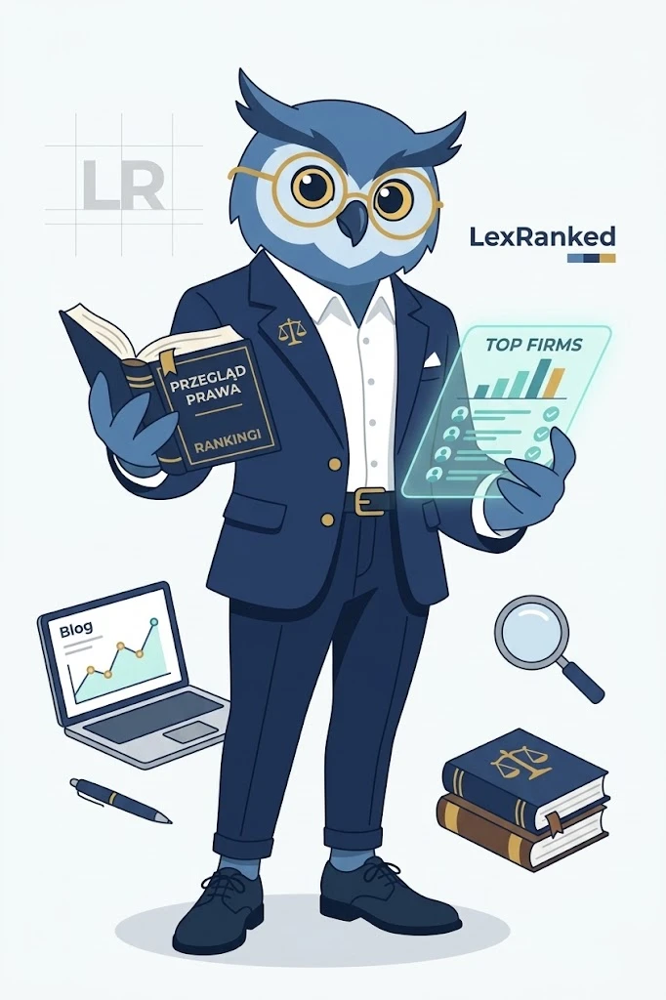

# Brand: the LexRanked owl

The LexRanked owl is the character of every guide image: a blue owl with
round gold glasses, a navy suit, white shirt and gold buttons, holding law
books or a ranking report. Files:

| File | Use |
|---|---|
| `docs/brand/lexranked-owl.webp` / `.png` | the reference character (original) |
| `workers/research/assets/lexranked-owl.png` | sent to the image model as the reference, so the owl stays the same in every image |
| `frontend/public/brand/guide-default.webp` | the featured image shown on a guide that has none of its own (also its social image) |

## Featured images for guides

- **Every guide has a featured image.** The template falls back to the
  default owl image, but each guide should get its own
  (`lexranked-images --post <id>`, see [ai.md](ai.md#featured-images-for-articles)).
- **The owl is the main character**, unchanged from the reference (colours,
  glasses, suit, proportions), in one simple scene with two or three props
  that represent the topic (a car and an insurance folder for a car-accident
  guide, a calendar for deadlines, scales for fees).
- **No text** anywhere: no words, letters, numbers, logos, labels or signs;
  book covers and screens stay blank.
- **Simple:** flat illustration, light plain background, navy / blue / gold
  palette, lots of empty space, landscape (1536×1024 generated, shown at
  1200×630 on cards and social previews).
- No human people (a lawyer-ranking site must not suggest real people or
  endorsements).
- Alt text describes what the image is for ("The LexRanked owl illustrating
  “…”").
